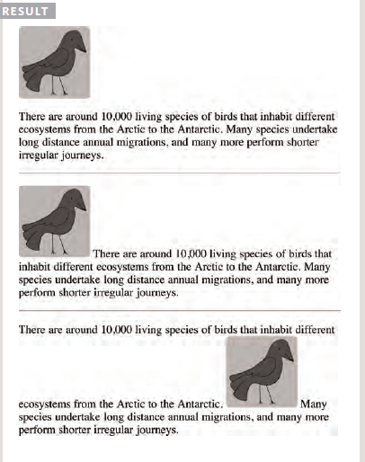
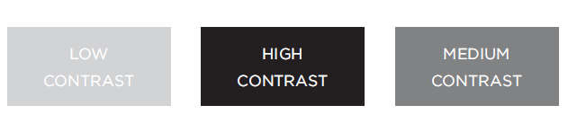

# Images #
## A picture can say a thousand words ##
- ### How to add images to pages ###
- create a folder for all of the images
the site uses.
- you need to use an ``
element 
   - ` src ` This tells the browser where
it can find the image file.
   - ` alt `This provides a text description
of the image
   - ` title `provide additional information
about the image.

##  Choosing the right format ##
   - ` height `This specifies the height of the
image in pixels.
   - ` width `This specifies the width of the
image in pixels.
  

### Where to Place Images in Your Code ###
1. #### before a paragraph ####
The paragraph starts on a new
line after the image.

2. #### inside the start of a paragraph ####
The first row of text aligns with
the bottom of the image.

3. #### in the middle of a paragraph ####
The image is placed between the
words of the paragraph that it
appears in.

## Optimizing images for the web ##

- You should save images at the size you will be using
them on the web page and in the appropriate format.
- Photographs are best saved as JPEGs; illustrations or
logos that use flat colors are better saved as GIFs.

# COLORS # 

- ### How to specify colors ###
  - #### rgb values ####
These express colors in terms of how much red, green and blue are used to make it up with a value between 0 and 255.
    rgb(red, green, blue)

- #### hex codes ####
These are six-digit codes that represent the amount of red, green and blue in a color, preceded by a pound or hash ` # ` sign.

- #### color names ####
There are 147 predefined color names that are recognized by browsers.

- #### Color terminology and contrast ####
- When picking foreground and background colors, it is important to ensure that there isenough contrast for the text to be legible.

# TEXT #

- #### Size and typeface of text ####

   1. font-family: 

   2. font-face Service-based: Commercial services give users
       access to a wider range of fonts
       using @font-face.

   3. Font-Face: [See this Link](https://developer.mozilla.org/en-US/docs/Web/CSS/@font-face )

-  Bold, italics, capitals, underlines

    -  Bold  : ` {font-weight: bold;} `  Its allows you to create bold text. 
    - Italic : `{font-style: italic;}` to create italic text.
    - capitals : ` <h1> `
               - uppercase
                This causes the text to appear uppercase.`{text-transform: uppercase;}` 

               - lowercase
                 This causes the text to appear lowercase.
         `{text-transform: lowercase;}`

- Spacing between lines, words, and letters

try to surf around text using this link [Demos](https://www.w3schools.com/cssref/pr_text_letter-spacing.asp)

