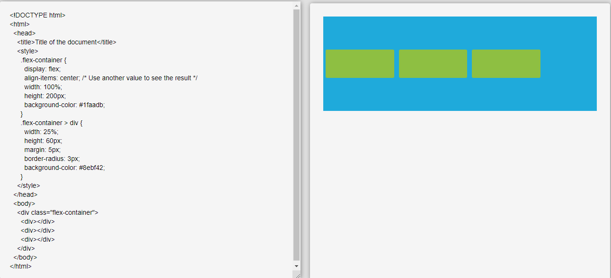
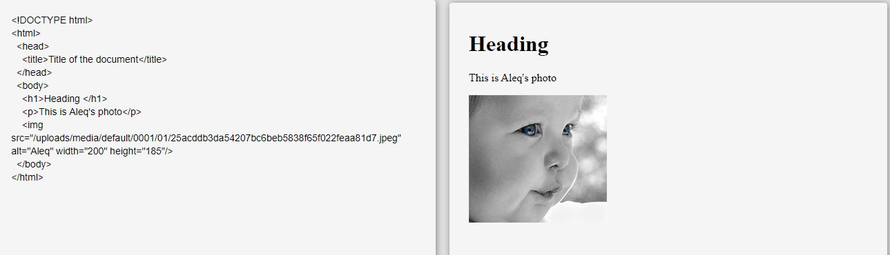
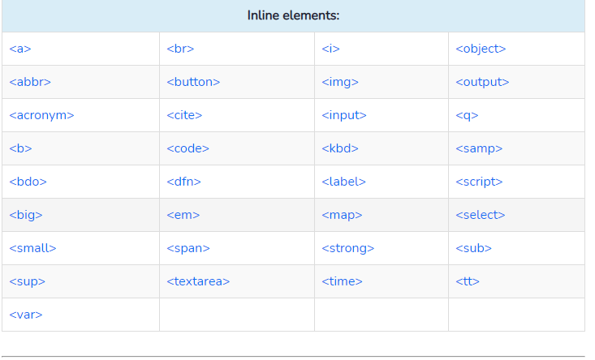

# Layout in CSS #

### Controlling t XX he position of elements ###

- ### block-level box or an inline box ###

   *Block-level* boxes start on a new line and act as the main building blocks of any layout, while inline boxes flow between surrounding text. You can control how much space each box takes up by setting the width of the boxes (and sometimes the height, too). To separate boxes, you can use borders, margins, padding, and background colors.

*Inline Elements*
Unlike block-level elements, inline elements do not start on a new line. They begin within a line and only take up as much width as it is necessary. Inline elements are included as a part of the main text.

### Controll ing thePosition of Elements ###
The `position` property specifies the type of positioning method used for an element.

There are five different position values:

-`static`:Static positioned elements are not affected by the top, bottom, left, and right properties.
-`relative`:Setting the top, right, bottom, and left properties of a relatively-positioned element will cause it to be adjusted away from its normal position. Other content will not be adjusted to fit into any gap left by the element.
-`fixed`:it always stays in the same place even if the page is scrolled. The top, right, bottom, and left properties are used to position the element.
-`absolute`:is positioned relative to the nearest positioned ancestor (instead of positioned relative to the viewport, like fixed).
-`sticky`: is positioned based on the user's scroll position.

Elements are then positioned using the `top`, `bottom`, `left`, and `right` properties. However, these properties will not work unless the position property is set first. They also work differently depending on the `position `value.

# CSS Frameworks #
CSS frameworks aim to make your life easier by providing the code for
common tasks, such as creating layout grids, styling forms, creating
printer-friendly versions of pages and so on. You can include the CSS
framework code in your projects rather than writing the CSS from scratch.

## Notes ##

-`
` elements are often used as containing elements
to group together sections of a page.

- Browsers display pages in normal flow unless you
specify relative, absolute, or fixed positioning.

- The float property moves content to the left or right
of the page and can be used to create multi-column
layouts. (Floated items require a defined width.)

- Pages can be fixed width or liquid (stretchy) layouts.

- Designers keep pages within 960-1000 pixels wide,
and indicate what the site is about within the top 600
pixels (to demonstrate its relevance without scrolling).

- Grids help create professional and flexible designs.

- CSS Frameworks provide rules for common tasks.

- You can include multiple CSS files in one page.