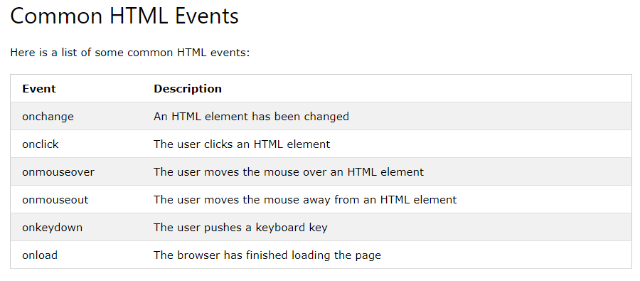
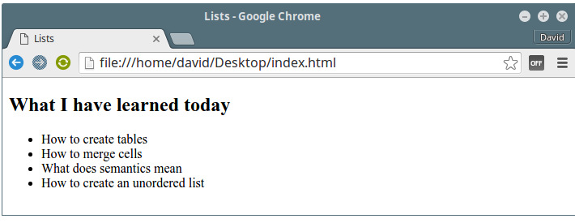
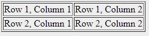

# Events in JS #

- JavaScript's interaction with HTML is handled through events that occur when the user or the browser manipulates a page.

- When the page loads, it is called an event. When the user clicks a button, that click too is an event

- Developers can use these events to execute JavaScript coded responses, which cause buttons to close windows, messages to be displayed to users, data to be validated, and virtually any other type of response imaginable.

- Events are a part of the Document Object Model (DOM)  and every HTML element contains a set of events which can trigger JavaScript Code.

- Event handlers can be used to handle and verify user input, user actions, and browser actions:

     - Things that should be done every time a page loads
     - Things that should be done when the page is closed
     - Action that should be performed when a user clicks a button
     - Content that should be verified when a user inputs data

     

# HTML Form #

- The `form` landmark role can be used to identify a group of elements on a page that provide equivalent functionality to an HTML form.

- There are various form elements available like text fields, textarea fields, drop-down menus, radio buttons, checkboxes, etc.

`<form action = "Script URL" method = "GET|POST">`
   `form elements like input, textarea etc.`
`</form>`

- There are different types of form controls that you can use to collect data using HTML form −

    - Text Input Controls
    - Checkboxes Controls
    - Radio Box Controls
    - Select Box Controls
    - File Select boxes
    - Hidden Controls
    -  Clickable Buttons
    - Submit and Reset Button

- ### Lists, Tables & Forms in html ###

#### Lists ###

**Unordered list**

- The first type is `<ul>`, which stands for Unordered List. Items in it are unindexed and are displayed as bullet points as default. Although the list is seen as unordered, the order of items is kept when displayed in a browser. `<ul>` is a paired tag that wraps list items.

- **List items**
The `<li>` tag, stands for List Item, takes a single item in the list, and wraps its text. Aside from text, it also takes images or any other type of element.

- `<h2>What I have learned today</h2>`
`<ul>`
       ` <li>How to create tables</li>`
        `<li>How to merge cells</li>`
        `<li>What does semantics mean</li>`
        `<li>How to create an unordered list</li>`
`</ul>`

- **Ordered list**
Unlike unordered lists, items in ordered lists are ordered using a key. All the key is, is a priority or sequence of events. Its syntax is exactly the same as that of unordered lists. We use the `<ol>` tag to wrap `<li>` list items. For ordered lists, browsers display numbers by default:

`<h2>My priority menu</h2>`
`<ol>`
        `<li>Spaghetti</li>`
        `<li>Creamy sauce</li>`
        `<li>Hamburger</li>`
        `<li>Cheese burger</li>`
        `<li>Broccoli</li>`
`</ol>`

### TABLES ###

- The HTML tables allow web authors to arrange data like text, images, links, other tables, etc. into rows and columns of cells.

The HTML tables are created using the ` <table>` tag in which the `<tr>` tag is used to create table rows and `<td>` tag is used to create data cells. The elements under `<td>` are regular and left aligned by default.

     
      <table border = "1">
         <tr>
            <td>Row 1, Column 1</td>
            <td>Row 1, Column 2</td>
         </tr>
         
         <tr>
            <td>Row 2, Column 1</td>
            <td>Row 2, Column 2</td>
         </tr>
      </table>

*The Result :*

For More Tutorials About Tables And its Format 

[W3Schools](w3schools.com)

