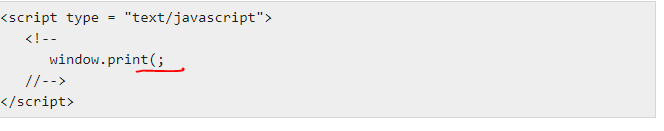

## Debugging ##

- Debugging isThe process of removing or correcting errors in the code .

- here are broadly two categories of bugs: *logical* (errors of thought in function and/or utility) and *syntactical* (errors in translating thoughts to code)

- Debigging using the **console.log() function**

- console.log() function which simply outputs data to the console. Say, you wanted to compute the cube of a number stored in a variable z

- **Errors** are statements which don't let the program run properly. There are three main types of errors that can occur while compiling a JavaScript program. These errors include syntax errors, runtime errors, and logical errors.

- **Syntax errors** are the most common type of error that occurs in any programming language. As the name suggests, something incorrect in the syntax of the program body raises this error. Syntax errors are also known as parsing errors. In JavaScript, they occur at the interpretation time.

- In this Example the following line causes a syntax error because it is missing a closing parenthesis.

- **Runtime Errors**
These type of error occurs during the runtime of the program, after it is interpreted by the compiler.

- In this Example the following line causes a runtime error because here the syntax is correct, but at runtime, it is trying to call a method that does not exist.

- **Logical Errors**
These type of errors are the most difficult to find. Consider a statement: ''John is playing guitar.'' This statement is logically correct and its syntax is also correct. Now consider another statement: ''Guitar is playing John.'' This statement is correct with respect to its syntax but is logically incorrect. These types of errors cause a serious problem as they change the whole path of how your program will work.

