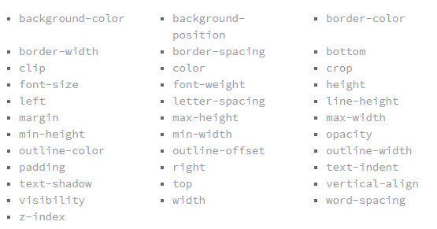

# Transitions & Animations #

### Transition ###

- **CSS** transitions allows you to change property values smoothly, over a given duration.
 
 - allow you to perform a gradual change to the value of one or multiple properties

 - In transition you can define which properties should change gradually, how long the change should take, the timing function that will be used, and other aspects.

 -  you can use the `transition` shorthand property.
 - ` transition-property`determines exactly what properties will be altered in conjunction with the other transitional properties.
 

 ** A handful of the more popular transitional properties include the following.**
  

- The `transition-timing-function` property specifies the speed curve of the transition effect.
- The `transition-delay` property specifies a delay (in seconds) for the transition effect.

### Animations ###

- Animations have multiple similar aspects to transitions, but there is a crucial difference: **they don’t depend on a change of property value to be triggered**.

- You have full control of when and how they are performed. They can even repeat a number of times or indefinitely.

- To use CSS animation, you must first specify some keyframes for the animation.

- `@keyframes` are the way to define the steps of a given animation. By using keyframes, you can control when and how the values of one or more properties change over time.

- The `animation-delay` property specifies a delay for the start of an animation.

- The `animation-iteration-count` property specifies the number of times an animation should run.

- The `animation-direction `property specifies whether an animation should be played forwards, backwards or in alternate cycles.

- `animation-fill-mode`: Controls how the animated element will be styled after the animation ends. It can retain the styles set by the last keyframe (forwards), the first keyframe (backwards), the first and last keyframes combined (both), or even reset the element to its original style (none, the default value).

- Reading Resources :
1. [Transition and animation](https://www.webdesignerdepot.com/2014/05/8-simple-css3-transitions-that-will-wow-your-users)

- For More Demos and practice :
[CSS3 Animations](https://codepen.io/akshaychauhan/pen/oAfae)
[Demo 404](https://codepen.io/kieranfivestars/pen/MYdQxX)
